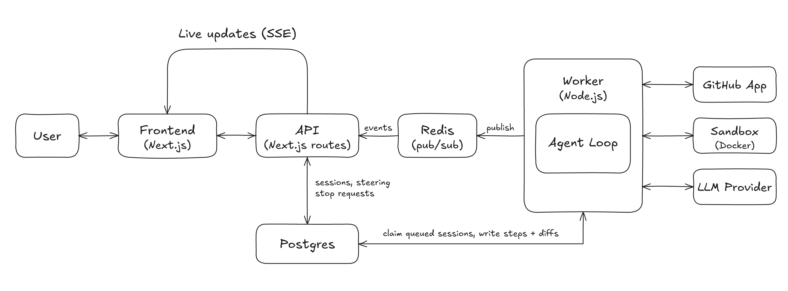

Forge is an autonomous software engineer. You can ask questions about your code, run agents that will fix issues or build features, and have them create PRs. Basically, an engineer for you that will work for you.

## Features

- Ask questions about your code and get answers without changing anything
- Hand off an issue or a feature idea and let the agent do the work
- Every finished run pushes a branch and opens a pull request for review
- Steer mid-run, pause, and resume sessions when plans change
- Watch everything stream in live: tool calls, code diffs, and every file the agent touches
- Each session runs in its own sandbox, isolated from your machine

## How it works

- Connect a GitHub repo and start a session. Ask a question or describe the issue or feature.
- The agent works in an isolated sandbox where it reads code, runs commands, and edits files.
- You watch progress live and steer mid-run if it drifts off course.
- When the work is done, your branch is pushed and a pull request is opened for review.

## Architecture

